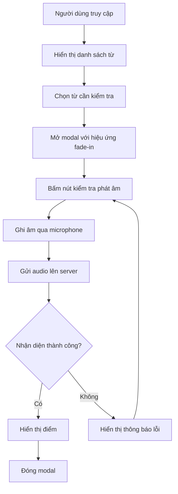

# Cute Pronunciation Checker

Ứng dụng kiểm tra phát âm tiếng Anh với giao diện thân thiện và hiệu ứng đẹp mắt.

## 📝 Mô tả

Cute Pronunciation Checker là một ứng dụng web cho phép người dùng:
- Kiểm tra phát âm tiếng Anh thông qua microphone
- Nhận điểm đánh giá chất lượng phát âm
- Giao diện thân thiện với nhiều hiệu ứng động

## 🔄 Flowchart 



## ✨ Hiệu ứng

1. **Hiệu ứng nút (Button Effects)**:
   - Hover effect với gradient màu từ hồng nhạt sang hồng đậm
   - Scale up và shadow khi hover
   - Ripple effect khi click
   - Transition mượt mà với cubic-bezier

2. **Hiệu ứng Modal**:
   - Fade-in animation khi mở
   - Blur backdrop
   - Scale và slide từ trên xuống
   - Close button với hiệu ứng xoay

3. **Hiệu ứng Title**:
   - Pulse animation liên tục
   - Float animation nhẹ nhàng
   - Text shadow động
   - Scale breathing effect

4. **Loading Effects**:
   - Dots animation khi đang ghi âm
   - Pulse effect cho record button
   - Fade transition cho kết quả
   - Smooth color changes

5. **Micro-interactions**:
   - Nút ripple effect
   - Hover state transitions 
   - Click feedback animations
   - Status indicator animations

6. **Responsive Animations**:
   - Tối ưu cho mobile
   - Adaptive grid animations
   - Touch-friendly interactions
   - Performance-focused effects

## 🎨 Theme màu

```css
:root {
    --primary-color: rgba(255, 229, 229, 0.9);    /* Hồng nhạt */
    --secondary-color: #4FA1D9;                   /* Xanh dương */
    --button-color: rgba(255, 182, 193, 0.8);     /* Hồng pastel */
    --hover-color: rgba(255, 105, 180, 0.9);      /* Hồng đậm */
    --active-color: rgba(255, 20, 147, 0.9);      /* Hồng sáng */
}
```

## 🌈 Gradient Effects

1. **Button Gradients**:
   ```css
   background: linear-gradient(45deg, var(--button-color), var(--hover-color));
   ```

2. **Modal Background**:
   ```css
   background: linear-gradient(135deg, var(--primary-color), rgba(255, 255, 255, 0.9));
   ```

3. **Hover States**:
   ```css
   transition: all 0.4s cubic-bezier(0.4, 0, 0.2, 1);
   ```

## 🎭 Animation Keyframes

```css
@keyframes float {
    0%, 100% { transform: translateY(0); }
    50% { transform: translateY(-10px); }
}

@keyframes pulse {
    0% { transform: scale(1); }
    50% { transform: scale(1.05); }
    100% { transform: scale(1); }
}

@keyframes modalFadeIn {
    from {
        opacity: 0;
        transform: translateY(-30px) scale(0.9);
    }
    to {
        opacity: 1;
        transform: translateY(0) scale(1);
    }
}
```

## 🔄 Loading States

- **Recording**: Dots animation (...)
- **Processing**: Pulse effect
- **Success**: Fade in với màu xanh
- **Error**: Shake effect với màu đỏ nhạt

## 🔧 Yêu cầu hệ thống

- Python 3.9
- Flask
- SpeechRecognition
- PyAudio
- Modern web browser hỗ trợ Web Speech API

## 📱 Responsive Design


Ứng dụng hỗ trợ đầy đủ các thiết bị:
- Mobile (< 480px)
- Tablet (481px - 768px)
- Laptop (769px - 1024px)
- Desktop (> 1024px)

## 🎯 Tính năng chính

1. **Nhận diện giọng nói**
   - Sử dụng Web Speech API
   - Hỗ trợ nhiều ngôn ngữ
   - Xử lý lỗi thông minh

2. **Đánh giá phát âm**
   - Thang điểm 1-10
   - Phản hồi chi tiết
   - Hiệu ứng loading khi đang xử lý

3. **Giao diện người dùng**
   - Thiết kế responsive
   - Hiệu ứng chuyển động mượt mà
   - Theme màu dễ chịu