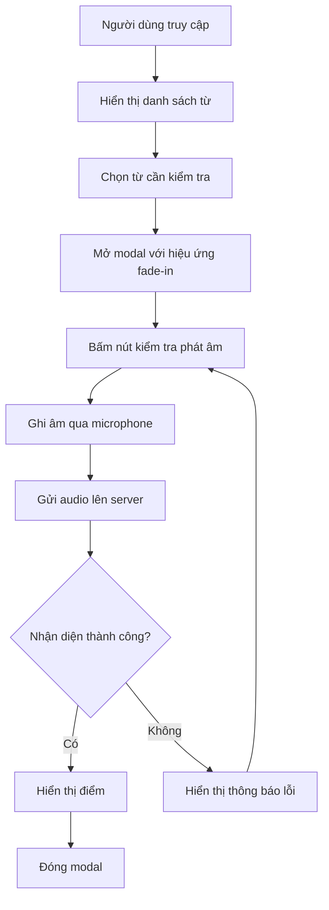

# Cute Pronunciation Checker

Ứng dụng kiểm tra phát âm tiếng Anh với giao diện thân thiện và hiệu ứng đẹp mắt.

## 📝 Mô tả

Cute Pronunciation Checker là một ứng dụng web cho phép người dùng:
- Kiểm tra phát âm tiếng Anh thông qua microphone
- Nhận điểm đánh giá chất lượng phát âm
- Giao diện thân thiện với nhiều hiệu ứng động

## 🔄 Flowchart 



## ✨ Hiệu ứng

1. **Hiệu ứng nút (Button Effects)**:
```

## 🔧 Yêu cầu hệ thống

- Python 3.9
- Flask
- SpeechRecognition
- PyAudio
- Modern web browser hỗ trợ Web Speech API

## 📱 Responsive Design


Ứng dụng hỗ trợ đầy đủ các thiết bị:
- Mobile (< 480px)
- Tablet (481px - 768px)
- Laptop (769px - 1024px)
- Desktop (> 1024px)

## 🎯 Tính năng chính

1. **Nhận diện giọng nói**
   - Sử dụng Web Speech API
   - Hỗ trợ nhiều ngôn ngữ
   - Xử lý lỗi thông minh

2. **Đánh giá phát âm**
   - Thang điểm 1-10
   - Phản hồi chi tiết
   - Hiệu ứng loading khi đang xử lý

3. **Giao diện người dùng**
   - Thiết kế responsive
   - Hiệu ứng chuyển động mượt mà
   - Theme màu dễ chịu

## 🤝 Đóng góp

Mọi đóng góp đều được chào đón! Hãy tạo pull request hoặc mở issue để thảo luận về những thay đổi bạn muốn thực hiện.

## 📄 License

MIT License - xem file [LICENSE.md](LICENSE.md) để biết thêm chi tiết.